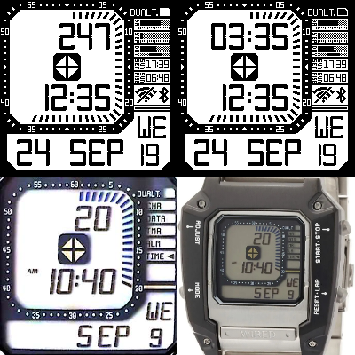

# watchy-MGSV

MGSV watchface for watchy

This watchface is primarily inspired by the WIRED AGAM601 watch featured in Metal Gear Solid V: The Phantom Pain

* step count
* sunrise/sunset time
* dual time

# settings

* To toggle between Dark Mode/Light Mode, push back button
* To toggle between 12-hour/24-hour, push down button
* To toggle between dual time and step count, push up button
* To calculate exact sunrise/sunset time, change `#define LOC 31.00, 121.00, 8` in `Watchy_7_SEG.cpp`, the three data represents latitude, longitude and timezone
* To set the GMT offset for network timing, change `#define GMT_OFFSET_SEC 3600 * 8 //New York is UTC -5` in `settings.h`
* To set the dual time, change `#define Time1Zone 8 #define Time2Zone -5` in `Watchy_7_SEG.cpp`, `Time1Zone` represents the time zone for network timing, `Time2Zone` represents the time zone for dual time